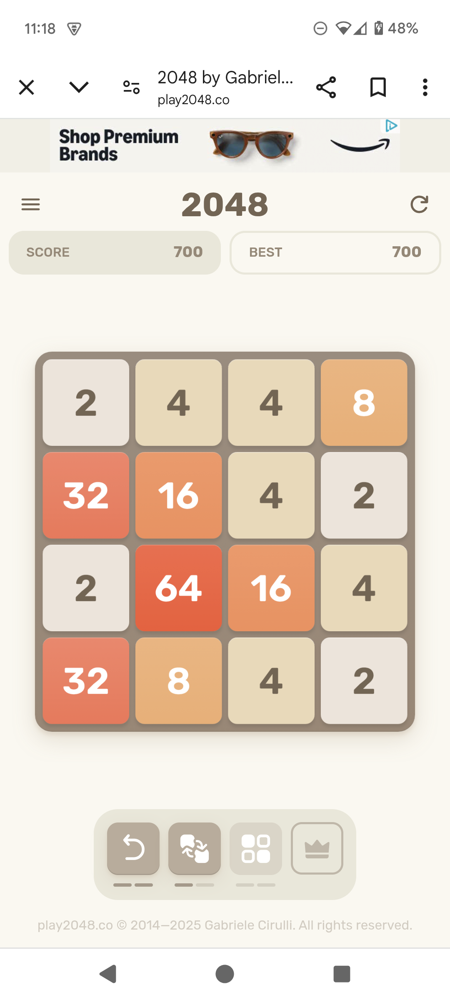

# 2048 OCR API


A Python-based OCR API for extracting 4×4 tile values from 2048 game screenshots using OpenCV and Tesseract. It includes
a FastAPI backend and a browser-based HTML frontend.

---

## Requirements

- Python 3.9+
- A modern web browser (for the frontend)
- Tesseract OCR installed and available in your system path

Install dependencies:

```sh
pip install -r requirements.txt
```

---

## Run Server

Start the FastAPI backend:

```sh
uvicorn ocr_api:app --reload
```

---

## Launch Frontend

Serve `index.html` with a simple HTTP server:

```sh
python -m http.server
```

Then open the page in your browser.

---

## Upload

Upload a screenshot of the 2048 game using the browser interface served by `index.html`.

---

## Example Output

<table>
  <tr>
    <td><strong>Input</strong></td>
    <td><strong>Output</strong></td>
  </tr>
  <tr>
    <td></td>
    <td valign="top">
      <pre><code>
🧩 OCR 2048 Board:
   2   4   4   8
  32  16   4   2
   2  64  16   4
  32   8   4   2
      </code></pre>
    </td>
  </tr>
</table>

---

## File Structure

```
.
├── index.html         # Frontend interface
├── ocr_api.py         # FastAPI backend
├── requirements.txt   # Python dependencies
```

---

## Credits

- [FastAPI](https://fastapi.tiangolo.com/) — backend framework
- [OpenCV-Python](https://pypi.org/project/opencv-python/) — board detection and image processing
- [pytesseract](https://pypi.org/project/pytesseract/) — Python wrapper for Tesseract OCR
- [Tesseract OCR](https://github.com/tesseract-ocr/tesseract) — text recognition engine
- [Python Imaging Library (Pillow)](https://pypi.org/project/Pillow/) — image format handling
